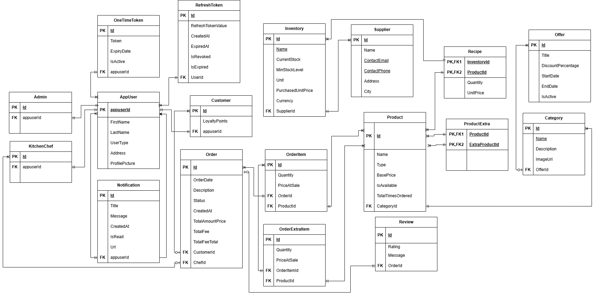
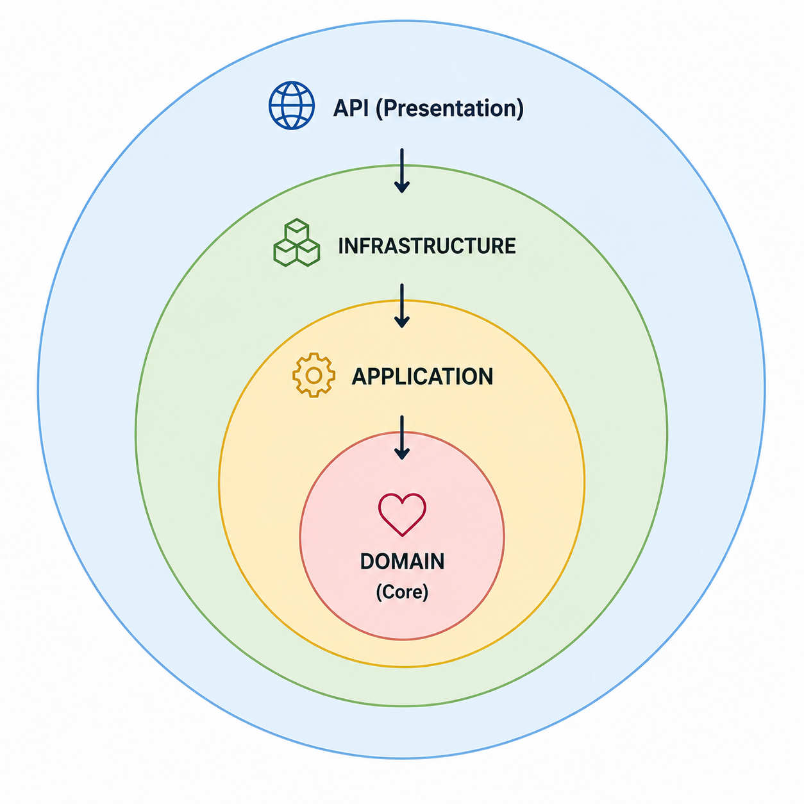

# AsyncPlate

 A production-inspired restaurant management system built with **ASP.NET Core**, following **Clean Architecture** and modern backend engineering practices.


<p align="center">


</p>

##  📖 Table of Contents

- [About](#-about)
- [Features](#-features)
- [Technology Stack](#️-technology-stack)
- [Database ERD](#️-database-erd)
- [Architecture](#️-architecture)
- [Solution Structure](#️-solution-structure)
- [Engineering Decisions](#-engineering-decisions)
- [Screenshots](#-screenshots)
- [Simple-JS-Client](#-real-time-test-client)
- [Getting Started](#-getting-started)
- [Author](#-author)
- [License](#-license)

#  📌 About

AsyncPlate is a production-inspired restaurant management platform that demonstrates modern backend engineering practices. It manages menus, orders, inventory, kitchen operations, notifications, reporting, and real-time communication while emphasizing clean architecture, scalability, and maintainability

# ✨ Features 

| Name | Description |
|---------|-------------|
|  **Authentication & Authorization** | JWT authentication, Refresh Tokens, Role-Based Access Control (RBAC), and password recovery using OTP verification. |
|  **Menu Management** | Manage products, categories, extras, and promotional offers with real-time updates. |
|  **Order Management** | Complete order lifecycle from creation to completion with real-time status tracking. |
|  **Kitchen Operations** | Instantly deliver orders to the kitchen with real-time inventory synchronization. |
|  **Inventory & Suppliers** | Manage suppliers, inventories, recipes, realtime ingredient consumption, and stock tracking. |
|  **Order Reviews** | Allow customers to rate and review completed orders. |
|  **Notification System** | Real-time notifications, email messages. |
|  **Reporting** | Automated daily PDF report generation powered by **QuestPDF** and **Hangfire**. |


# 🛠️ Technology Stack
| Category | Technologies |
|----------|--------------|
| **Backend** | ASP.NET Core Web API, Entity Framework Core, SQL Server, SignalR, Hangfire |
|  **Authentication** | JWT, Refresh Tokens |
|  **Architecture & Design** | Clean Architecture, Repository Pattern, Unit of Work |
| **Libraries & Frameworks** | FluentValidation, AutoMapper |
|  **API Documentation** | Swagger / OpenAPI |
| **Reporting** | QuestPDF |
|  **Email** | Mailtrap |

# 🗄️ Database ERD

The system uses a relational database designed to maintain data integrity, minimize redundancy, and efficiently model restaurant operations.

<p align="center">
    
</p>


# 🏗️ Architecture

<p align="center">
  
</p>

AsyncPlate follows **Clean Architecture**, organizing the solution into **four independent layers**:

| Layer | Responsibility |
|-------|----------------|
| **Presentation** | Handles HTTP requests, API endpoints, and client communication. |
| **Application** | Contains business use cases, validation, and application logic. |
| **Domain** | Defines core entities and business rules. |
| **Infrastructure** | Implements data access, authentication, email services, and other external integrations. |

#  🗂️ Solution Structure 

```text
AsyncPlate/
│
├── AsyncPlate.API      # Presentation Layer (HTTP/WebSocket Gateway Entry point)
│   ├── Controllers
│   ├── Middlewares
│   └── ResponseModel
│
├── AsyncPlate.Application       # Use Case Layer (Core business orchestration)
│   ├── DTOs
│   ├── Interfaces
│   ├── Services
│   ├── Mapping
│   └── Validators
│
├── AsyncPlate.Domain        # Core Layer (Zero external dependencies)
│   └── Entities
│
└── AsyncPlate.Infrastructure       # Infrastructure Layer (External tools & data storage)
    ├── Data
    ├── Repositories
    ├── Services
    ├── Hubs
    ├── Jobs
    └── Configurations
```

# 💡 Engineering Decisions

| Decision | Benefit |
|----------|---------|
|  **Repository + Unit of Work** | Abstracts data access and ensures transactional consistency across multiple operations. |
|  **Async/Await** | Implements asynchronous I/O operations to improve scalability and responsiveness by preventing thread blocking. |
|  **Performance Optimization** | Optimizes read operations using projections, selective eager loading, `AsNoTracking()` for read-only queries, and proper database indexing to improve performance and reduce memory usage. |
| **SignalR** | Enables real-time communication for updates,  synchronization without client polling. |
|  **Hangfire** | Executes background and scheduled jobs, such as email delivery and PDF report generation, without impacting API responsiveness. |
| **FluentValidation** | Centralizes validation logic, keeping controllers and handlers clean while improving maintainability. |
| **AutoMapper** | Simplifies object-to-object mapping, reducing boilerplate code and improving maintainability. |


# 📸 Screenshots
The following screenshots demonstrate testing some features of AsyncPlate.

<table>
 
  <tr>
    <td></td>
    <td></td>
    <td></td>
  </tr>
  <tr>
    <td></td>
    <td></td>
     <td></td>
  </tr>
  <tr>
    <td></td>
 <td></td>
  <td></td>
  </tr>
  
  <tr>
    <td></td>
    <td></td>
     <td></td>
  </tr>
  <tr>
    <td></td>
    <td></td>
  </tr>
</table>
  
# 🧪 Real-Time Test Client

A lightweight JavaScript client for testing SignalR real-time communication. It connects to the `RealtimeHub` using JWT authentication and verifies `live notifications`, `order status updates`, and `menu synchronization`.

# 🚀 Getting Started

Follow these steps to configure and run AsyncPlate locally.

## 1. Configure Application Settings

Create or update `AsyncPlate.API/appsettings.Development.json` with your local configuration values.

```json
{
  "ConnectionStrings": {
    "DefaultConnection": "your default DB connection"
  },

  "Jwt": {
    "Key": "your-jwt-secret-key",
    "Issuer": "your issuer",
    "Audience": "your audience",
    "ExpireMinutes": 60
  },

  "MailSandBoxService": {
    "ApiToken": "your mail api token",
    "InboxId": 123456,
    "SenderEmail": "your-email@example.com",
    "SenderName": "AsyncPlate Team"
  }
}
```

> **⚠️ Security:** Never commit configuration files containing secrets or API keys. Keep them in `appsettings.Development.json` (which should be ignored by Git) or use environment variables in production.

---

## 2. Apply Database Migrations

Create the database and apply the latest Entity Framework Core migrations.

```bash
update-database
```

---

## 3. Run the Application

Start the API using:

```bash
dotnet run --project AsyncPlate.API --launch-profile https
```

---

## 4. Access Swagger UI

After the application starts successfully, open the Swagger UI in your browser:

```text
https://localhost:51499/swagger/index.html
```

> **Note:** The port number may differ depending on your local development environment.


# 👩‍💻 Author

**Alyaa Ahmed**

- GitHub: https://github.com/alyaaa7med
- LinkedIn: https://www.linkedin.com/in/alyaa-ahmed12/

# 📄 License

This project is licensed under the MIT License. See the [LICENSE](License.txt) file for details.